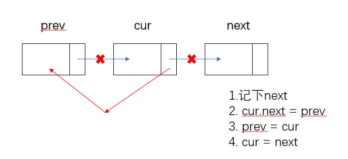

## 206.反转链表
给你单链表的头节点 head ，请你反转链表，并返回反转后的链表。

- 保留节点，然后逆序
  ```python
  class Solution:
      def reverseList(self, head: ListNode) -> ListNode:
          nodes = list()
          while head:
              nodes.append(head)
              head = head.next
          tmp = res = ListNode(0)
          for node in nodes[::-1]:
              tmp.next = node
              tmp = tmp.next
          tmp.next = None
          return res.next
  ```
- 值保留, 然后逆序输出值的新节点
  ```python
  class Solution:
      def reverseList(self, head: ListNode) -> ListNode:
          memo = list()
          while head:
              memo.append(head.val)
              head = head.next
          res = tmp = ListNode(0)
          for val in memo[::-1]:
              tmp.next = ListNode(val)
              tmp = tmp.next
          return res.next
  ```
- 栈，和上面类似
- 递归
  ```text
  1. 如果当前节点为空或者只剩下一个元素
  2. 如果存在多个元素，如reverse(a1,...,an) = reverse(a2,...,an), a1
     即后续的所有元素都已经处理好，现在只需处理和a1的关系即可
     a1.next.next = a1
     a1.next = None
  ```
  ```python
  class Solution:
      def reverseList(self, head: ListNode) -> ListNode:
          if not head or not head.next: return head
          res = self.reverseList(head.next)
          head.next.next = head
          head.next = None
          return res
  ```
- 迭代(最硬核)
  
  ```python
  class Solution:
    def reverseList(self, head: ListNode) -> ListNode:
        if not head or not head.next: return head
        prev, cur = None, head
        while cur:
            next = cur.next
            cur.next = prev
            prev = cur
            cur = next
        return prev
  ```